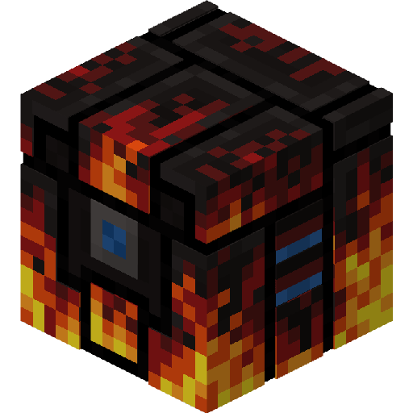

# 拓奇科马 Torchikoma

发射火把，用于远程点亮地面或者击败怪物，并增加了更多火把，最后制造属于你的步行机甲，帮你插火把或者战斗。

Launch torches, which are used to light the ground remotely or defeat monsters, add more torches, and finally create your walking mecha to help you insert torches or fight.

* 基本
    * [主页](index.md)
    * [方块光探测器](./basic/block/blocklight_detector.md)
* 自定义
    * [自定义拓奇科马涂装](./custom/custom_torchikoma_painting.md)
* 开发
    * ....
